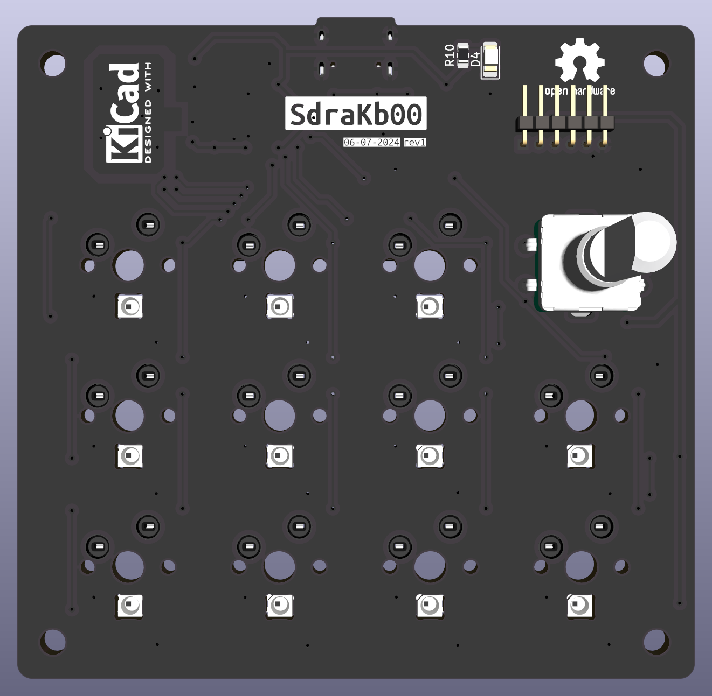
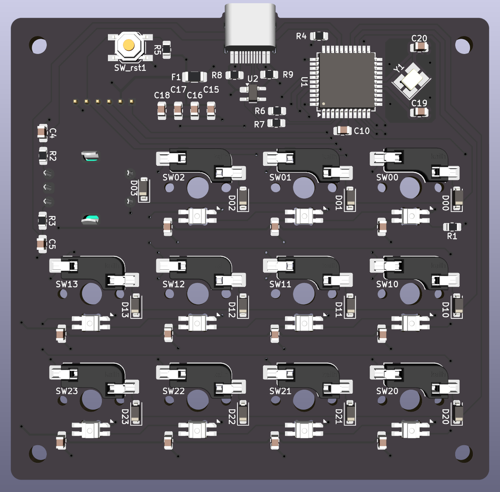
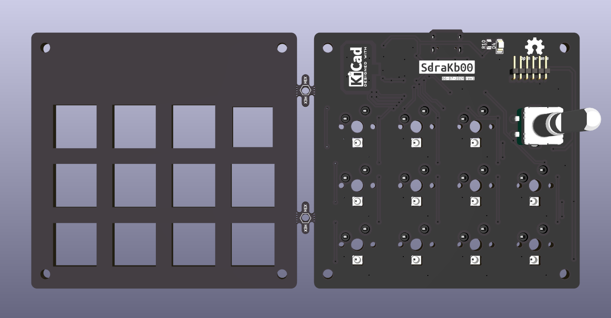

# SdraKb00

11 keys hot-swap macropad with rotary encoder.

## Features

- 11 keys
- Rotary encoder
- AtMega32U4 MCU
- Per-key RGB led for backlighting
- USB-C connector
- On PCB SPI header
- MCU reset button
- Switch mounting plate
- Power LED indicator

## Layout

[](http://www.keyboard-layout-editor.com/##@_backcolor=%23101C24&name=SdraKb00&author=drabaioli&switchMount=cherry&switchBrand=gateron&switchType=KS-3-Red&plate:true&pcb:false%3B&@_c=%23101C24&t=%2388FB7A%3B&=%3Ci%20class%2F='fa%20fa-fast-backward'%3E%3C%2F%2Fi%3E&=%3Ci%20class%2F='fa%20fa-play'%3E%3C%2F%2Fi%3E&=%3Ci%20class%2F='fa%20fa-fast-forward'%3E%3C%2F%2Fi%3E&_a:7&f:9%3B&=%3Ci%20class%2F='fa%20fa-circle-o-notch'%3E%3C%2F%2Fi%3E%3B&@_f:3%3B&=&=&=&_c=%2388FB7A&t=%23101C24%3B&=%3B&@_c=%23101C24&t=%2388FB7A&a:4%3B&=%3Ci%20class%2F='fa%20fa-chrome'%3E%3C%2F%2Fi%3E&=%3Ci%20class%2F='fa%20fa-terminal'%3E%3C%2F%2Fi%3E&=%3Ci%20class%2F='fa%20fa-youtube-play'%3E%3C%2F%2Fi%3E&=%3Ci%20class%2F='fa%20fa-spotify'%3E%3C%2F%2Fi%3E)

## Schematic

## PCB

## Switch plate

